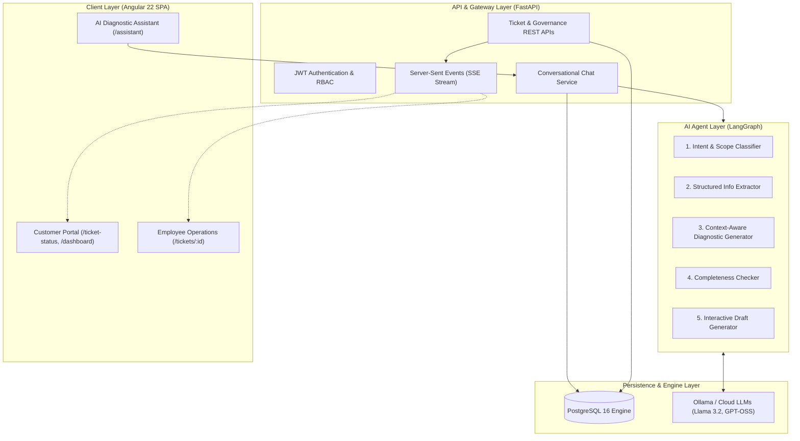
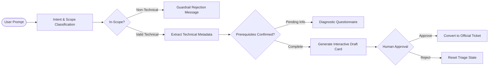
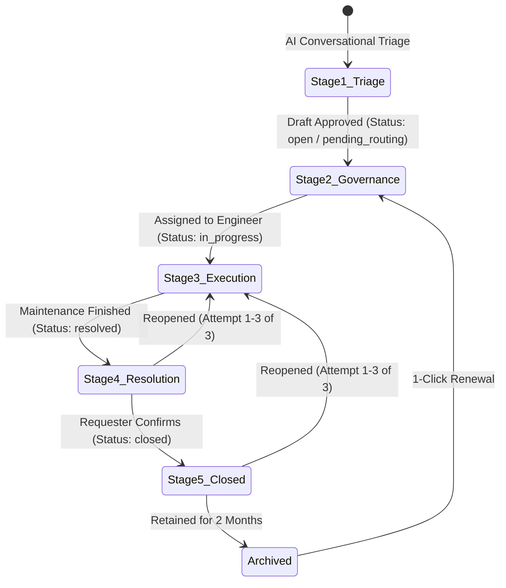

# 🚀 SupportHub AI — Autonomous IT Support & Operations Platform

An enterprise-grade, autonomous IT support triage and application lifecycle management platform powered by **FastAPI**, **LangGraph Multi-Turn Diagnostic Agents**, **PostgreSQL**, **Ollama LLMs**, and a modern **Angular 22** executive frontend with a Corona Dark design system.

---

## 📑 Table of Contents
1. [Platform Architecture & System Workflow](#-platform-architecture--system-workflow)
2. [Core Application Activities & Execution Modes](#-core-application-activities--execution-modes)
3. [Autonomous AI Diagnostic Triage (LangGraph)](#-autonomous-ai-diagnostic-triage-langgraph)
4. [5-Stage Ticket Lifecycle & Governance](#-5-stage-ticket-lifecycle--governance)
5. [Real-Time Notifications & Dedicated Ticket Status Tracker](#-real-time-notifications--dedicated-ticket-status-tracker)
6. [Role-Based Access Control & User Directory](#-role-based-access-control--user-directory)
7. [Tech Stack](#-tech-stack)
8. [Quick Start with Docker](#-quick-start-with-docker)
9. [Local Development Setup](#-local-development-setup)
10. [Automated Testing & Verification](#-automated-testing--verification)
11. [REST API Documentation](#-rest-api-documentation)

---

## 🏗️ Platform Architecture & System Workflow



---

## 🎯 Core Application Activities & Execution Modes

SupportHub AI strictly standardizes enterprise ticket management into **4 core Application Activities**. Each activity is governed by its technical execution mode, downtime requirements, default priorities, and static naming conventions:

| Activity Name | Static Ticket Title | Execution Mode | Downtime Requirement | Default Priority | Diagnostic Checklist |
| :--- | :--- | :---: | :---: | :---: | :--- |
| **Application UI** | `Application UI Maintenance` | `Online` | **No Downtime** | `Medium` | Administrator authorizations, backend API gateways, tracked deployment packages. |
| **File Management** | `File Management Operations` | `Online` | **No Downtime** | `Medium` | Storage mount paths, OS file permissions, archival quotas. |
| **Client Data Transfer** | `Client Data Transfer` | `Hybrid` | **User Lockout** | `High` | Source/target tenant lockouts, data schema mapping, rollback snapshots. |
| **Application Version Maintenance** | `Application Version Maintenance` | `Offline` | **Yes (Planned Downtime)** | `Critical` | Target version binary compatibility, OS/DB backups, approved service halt window. |

> [!NOTE]
> **Priority Defaulting & Customization**: Priority is automatically pre-selected based on the execution mode so it is never empty, while remaining fully customizable (`low`, `medium`, `high`, `critical`) by the customer.

---

## 🤖 Autonomous AI Diagnostic Triage (LangGraph)

The AI Agent utilizes a stateful **LangGraph** execution pipeline:



### Context-Aware Diagnostic Rules
- **Online Activities** (`Application UI`, `File Management`): The AI **only** verifies Prerequisites Status and does **not** ask for a maintenance window.
- **Offline & Hybrid Activities** (`Application Version Maintenance`, `Client Data Transfer`): The AI requires **both** Prerequisites Status verification and the Approved Maintenance Window date/time.
- **Mandatory Field Governance**: `Title`, `Category`, `Priority`, and `Issue Description` are strictly mandatory before approval or submission.


---

## 🔄 5-Stage Ticket Lifecycle & Governance

Every ticket moves through an auditable, five-stage operational lifecycle:



1. **Stage 1 — AI Diagnostic & Prerequisites**: Real-time multi-turn triage collecting prerequisites and metadata.
2. **Stage 2 — Specialist Assignment & Governance**: Admins and Managers review restricted maintenance operations, route requests, or assign employees.
3. **Stage 3 — Engineering Work in Progress**: Support engineers execute tasks, log operational updates, and attach completion notes.
4. **Stage 4 — Operational Resolution & Verification**: Activity verified and marked as `resolved`. Requesters receive instant alerts to review the completion.
5. **Stage 5 — Finalized, Reopenable (3-Attempt Cap) & Retention**:
   - Requesters can confirm and close the ticket.
   - Requesters can **reopen up to 3 times** with mandatory reasoning and safety policy warnings.
   - Tickets are retained for **2 months**, after which they move to **Archived** status with 1-click renewal.

---

## 🔔 Real-Time Notifications & Dedicated Ticket Status Tracker

### 1. Instant Proactive Alerts (SSE)
- **Employee Resolution Toast**: When an engineer resolves a ticket, a top-right notification toast is immediately emitted.
- **One-Time Customer Login Toast**: When a customer logs in, the system checks for newly resolved tickets and displays a green notification toast once per resolution without recurring on page reloads.

### 2. Dedicated "Ticket Status" Page (`/ticket-status`)
To prevent the main dashboard from becoming congested when users submit multiple tickets:
- **Interactive Metric Counters**: Live counts for *Total Requests*, *In Progress*, *Resolved*, and *Closed*.
- **Search & Filter Suite**: Filter by keyword, Application Activity Category, or Execution Mode.
- **5-Step Visual Stepper Cards**: Individual progress trackers detailing step-by-step progress, assigned engineers, execution modes, and action buttons (*Inspect Resolution*, *Confirm & Close*, *Reopen Ticket*).
- **Clean Dashboard**: The main Dashboard remains sleek and uncluttered, providing a concise summary overview with direct links to the Tracker.

---

## 👥 Role-Based Access Control & User Directory

SupportHub AI includes **13 pre-seeded accounts** across 4 corporate tiers. Default password for all demo accounts: **`password123`**.

| Tier | Name | Email | Primary Responsibilities |
| :--- | :--- | :--- | :--- |
| **Manager** (1) | **Mathan** | `mathan@company.com` | Ticket governance, reopens, escalations, out-of-scope routing, deletion of resolved tickets. |
| **Admin** (2) | **Adhi** | `adhi@company.com` | Full governance, restricted operation approvals, user and role administration. |
| | **Giri** | `giri@company.com` | Systems administration, operations oversight, and approval management. |
| **Employee** (3) | **Eegan** | `eegan@company.com` | Operational maintenance execution, progress updates, verification, and resolution. |
| | **Hari** | `hari@company.com` | Active execution of maintenance requests, completion notes. |
| | **Basker** | `basker@company.com` | Technical resolution and deployment verification. |
| **User / Customer** (7) | **Venu** | `venu@company.com` | Submits maintenance requests, AI triage, status tracking, and draft approval. |
| | **Santhosh** | `santhosh@company.com` | Triage interaction and status tracking. |
| | **Harsh** | `harsh@company.com` | Submits support requests, reviews resolutions. |
| | **Kasi** | `kasi@company.com` | Ticket creation, resolution inspection, and renewals. |
| | **Deepesh** | `deepesh@company.com` | Customer issue reporting and draft verification. |
| | **Manoj** | `manoj@company.com` | Application support requests and status tracking. |
| | **Priya** | `priya@company.com` | Maintenance requests, completion reviews, and approvals. |

> [!TIP]
> You can switch between any of these profiles in real time using the **3-Dots Profile Switcher** in the top-right corner of the application.

---

## 💻 Tech Stack

- **Backend**:
  - Python 3.11+
  - FastAPI (Asynchronous REST API)
  - LangGraph & LangChain (Stateful diagnostic agent graph)
  - SQLAlchemy 2.0 (Async ORM) & Alembic
  - PostgreSQL 16
  - Ollama (Local & Cloud LLM support: `llama3.2:3b`, `gpt-oss:120b-cloud`)
  - `uv` (High-performance Python package management)
- **Frontend**:
  - Angular 22 (Standalone components, reactive signals)
  - Corona Dark Executive Theme & Material Design 3 tokens
  - Server-Sent Events (SSE) for real-time reactivity
- **DevOps & Infrastructure**:
  - Docker & Docker Compose
  - Nginx (Reverse proxy and SPA static delivery)

---

## 🚀 Quick Start with Docker

### Prerequisites
- [Docker Desktop](https://www.docker.com/) installed and running.

### 1. Launch Services
```bash
# Clone the repository and navigate into the project directory
cd "LLM Project"

# Start PostgreSQL, FastAPI Backend, and Angular UI
docker compose up -d --build
```

### 2. Access the Application
- 🌐 **Web Application**: [http://localhost:3000](http://localhost:3000)
- 📊 **Ticket Status Tracker**: [http://localhost:3000/ticket-status](http://localhost:3000/ticket-status)
- 📚 **Swagger API Docs**: [http://localhost:8000/docs](http://localhost:8000/docs)
- 🩺 **Health Check**: [http://localhost:8000/health](http://localhost:8000/health)

---

## 🛠️ Local Development Setup

### 1. Backend Setup with `uv`
```bash
cd backend

# Create virtual environment and install dependencies
uv venv
.\.venv\Scripts\activate      # Windows (or source .venv/bin/activate on Linux/macOS)
uv pip install -r requirements.txt

# Start FastAPI development server
uvicorn app.main:app --host 0.0.0.0 --port 8000 --reload
```

### 2. Frontend Setup
```bash
cd frontend

# Install Node dependencies
npm install

# Start Angular development server
npm start
```
*Frontend runs on `http://localhost:4200` and proxies API requests to `http://localhost:8000`.*

---

## 🧪 Automated Testing & Verification

Run the comprehensive automated test suite covering RBAC, state machine transitions, AI triage, prompt guardrails, and priority mappings:

```bash
# Run pytest backend suite
cd backend
pytest -v

# Run multi-activity execution mode and priority verification script
python scratch/test_all_priorities.py
```

---

## 📡 REST API Documentation

| Method | Endpoint | Description |
| :--- | :--- | :--- |
| `POST` | `/api/auth/login` | Authenticate user and issue JWT access token |
| `GET` | `/api/auth/me` | Fetch authenticated user profile and roles |
| `GET` | `/api/tickets` | Query tickets with status, category, and keyword filters |
| `POST` | `/api/tickets` | Create a support ticket manually |
| `GET` | `/api/tickets/{id}` | Retrieve ticket details, audit history, and comment threads |
| `PATCH` | `/api/tickets/{id}` | Update status, reassign engineer, or adjust priority |
| `POST` | `/api/tickets/{id}/comments` | Add notes or comments to ticket audit log |
| `POST` | `/api/tickets/{id}/reopen` | Reopen resolved/closed ticket (enforces 3-reopen limit) |
| `POST` | `/api/tickets/{id}/close` | Confirm completion and close ticket |
| `POST` | `/api/tickets/{id}/renew` | Renew and reopen an archived ticket |
| `POST` | `/api/chat/sessions` | Initialize a LangGraph triage session |
| `POST` | `/api/chat/sessions/{id}/messages` | Post user message and execute diagnostic graph turn |
| `POST` | `/api/chat/sessions/{id}/drafts/{draft_id}/approve` | Approve structured AI draft and create ticket |
| `POST` | `/api/chat/sessions/{id}/drafts/{draft_id}/reject` | Reject AI draft and reset triage flow |
| `GET` | `/api/dashboard/stats` | Retrieve aggregated dashboard operational KPIs |
| `GET` | `/api/events/stream` | Server-Sent Events (SSE) stream for live updates |
| `GET` | `/health` | API and database health check endpoint |
