# AI-Powered Ticket Management System — Technical Blueprint

## Table of Contents
1. [High-Level Design (HLD)](#1-high-level-design)
2. [Low-Level Design (LLD)](#2-low-level-design)
3. [ER Diagram & Database Schema](#3-er-diagram--database-schema)
4. [Directory Structure](#4-directory-structure)
5. [API Contract](#5-api-contract)
6. [LangGraph Agent Architecture](#6-langgraph-agent-architecture)
7. [Ticket State Machine](#7-ticket-state-machine)
8. [RBAC Model](#8-rbac-model)
9. [Implementation Roadmap](#9-implementation-roadmap)

---

## 1. High-Level Design

### System Context Diagram

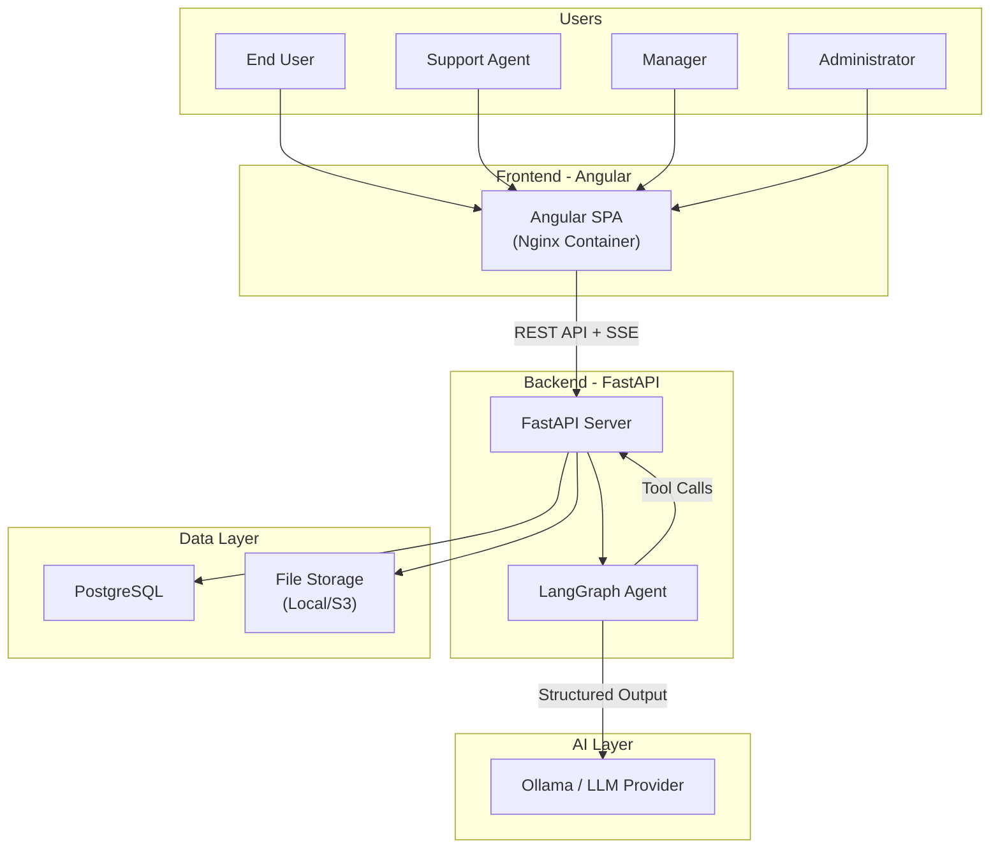

### Component Architecture

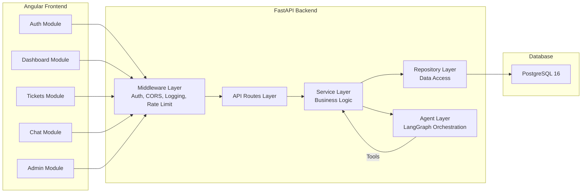

### Key Architectural Decisions

| Decision | Choice | Rationale |
|---|---|---|
| Frontend Framework | Angular 18+ (standalone components) | Matches plan requirements; strong typing, reactive forms |
| Backend Framework | FastAPI | Async support, Pydantic native, OpenAPI auto-docs |
| Database | PostgreSQL 16 | ACID, JSONB for metadata, robust constraints |
| ORM | SQLAlchemy 2.0 + Alembic | Async support, migration management |
| AI Orchestration | LangGraph | Stateful graph, checkpointing, human-in-the-loop |
| Auth | JWT (access + refresh tokens) | Stateless, scalable |
| Real-time Updates | SSE (Server-Sent Events) | Simpler than WebSockets for one-way dashboard updates |
| Chat Streaming | SSE per message | Stream AI responses token-by-token |
| Containerization | Docker + Docker Compose | Local dev parity, single-command startup |
| File Storage | Local volume (dev), S3-compatible (prod) | Simple start, production-ready path |

---

## 2. Low-Level Design

### 2.1 Backend Layer Architecture

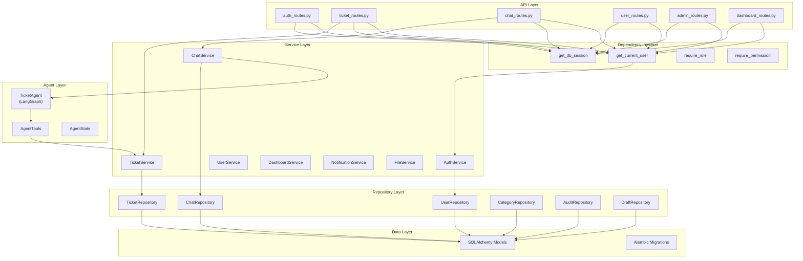

### 2.2 Authentication Flow

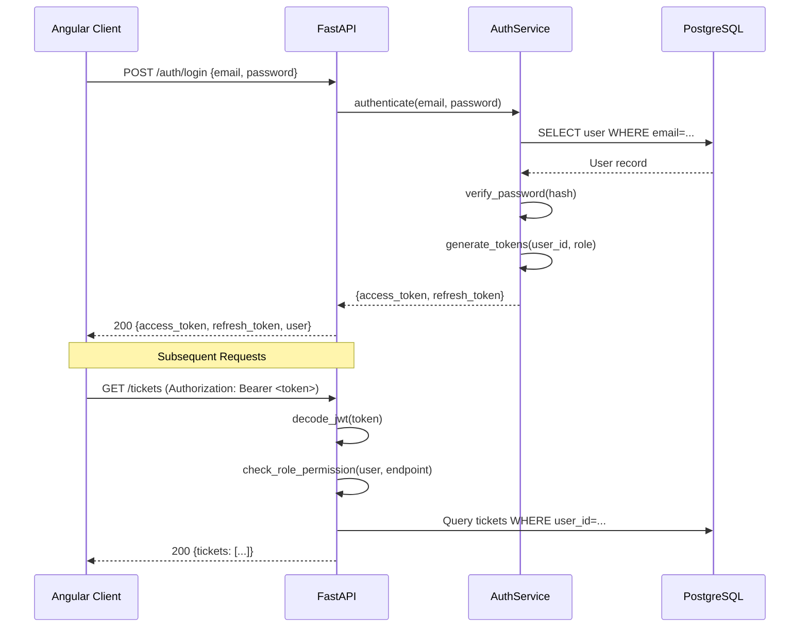

### 2.3 AI Ticket Creation Flow

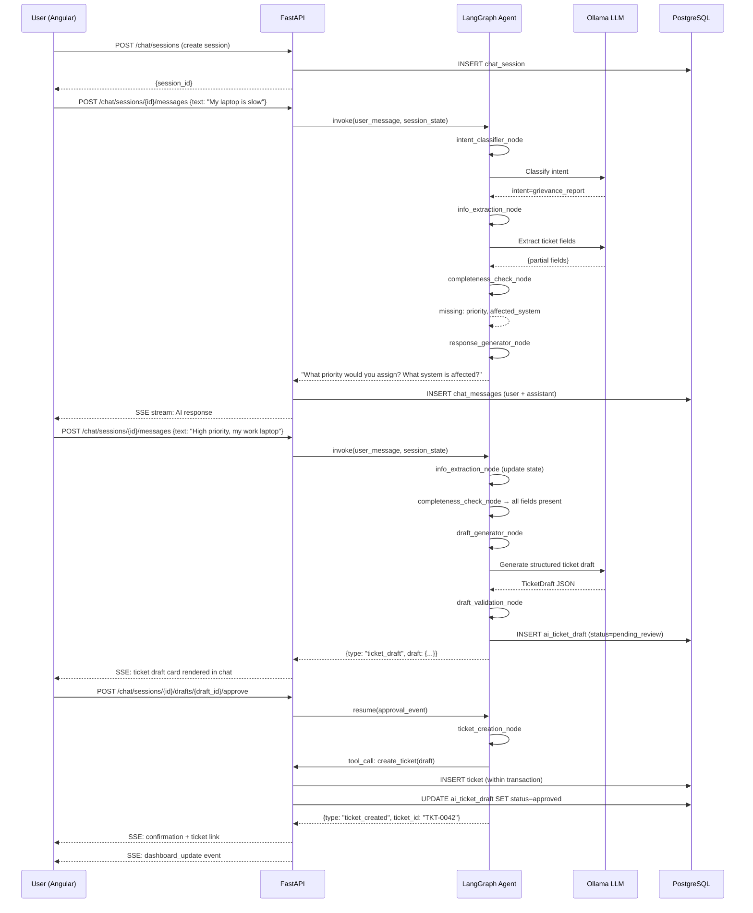

### 2.4 Manual Ticket Creation Flow

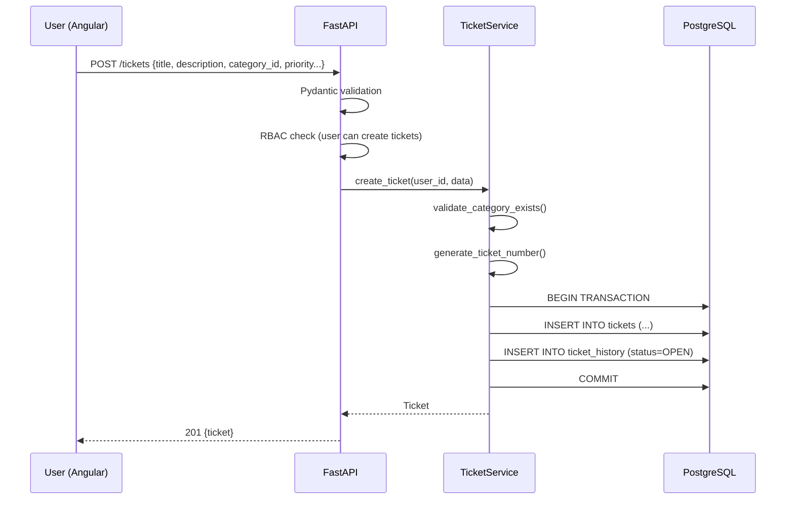

---

## 3. ER Diagram & Database Schema

### ER Diagram

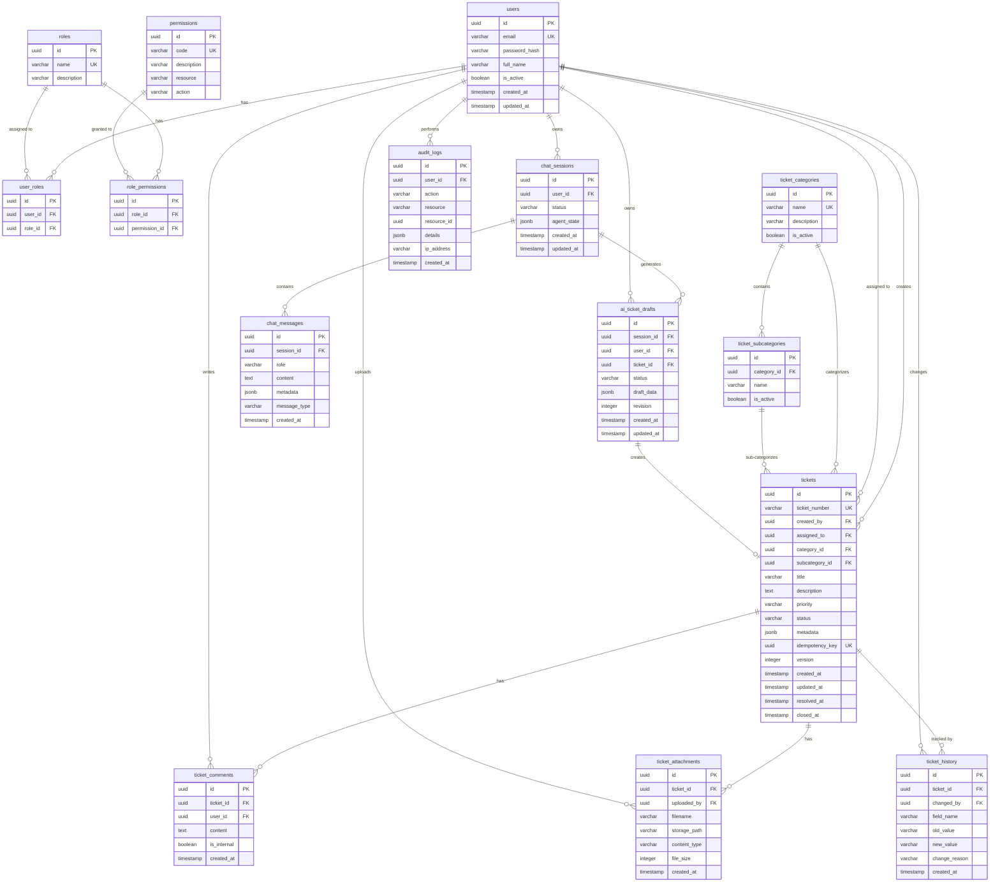

### Table Details

#### `tickets` — Core ticket entity

| Column | Type | Constraints | Notes |
|--------|------|-------------|-------|
| id | UUID | PK, DEFAULT gen_random_uuid() | |
| ticket_number | VARCHAR(20) | UNIQUE, NOT NULL | Format: `TKT-YYMMDD-XXXX` |
| created_by | UUID | FK → users.id, NOT NULL | |
| assigned_to | UUID | FK → users.id, NULLABLE | |
| category_id | UUID | FK → ticket_categories.id, NOT NULL | |
| subcategory_id | UUID | FK → ticket_subcategories.id, NULLABLE | |
| title | VARCHAR(255) | NOT NULL | |
| description | TEXT | NOT NULL | |
| priority | VARCHAR(20) | NOT NULL, CHECK IN ('low','medium','high','critical') | |
| status | VARCHAR(20) | NOT NULL, CHECK IN ('draft','open','assigned','in_progress','escalated','resolved','closed','reopened','cancelled') | |
| metadata | JSONB | DEFAULT '{}' | Extensible fields |
| idempotency_key | UUID | UNIQUE, NULLABLE | Prevents duplicate creation |
| version | INTEGER | DEFAULT 1, NOT NULL | Optimistic locking |
| created_at | TIMESTAMPTZ | DEFAULT now() | |
| updated_at | TIMESTAMPTZ | DEFAULT now() | |
| resolved_at | TIMESTAMPTZ | NULLABLE | |
| closed_at | TIMESTAMPTZ | NULLABLE | |

**Indexes**: `(created_by)`, `(assigned_to)`, `(status)`, `(priority)`, `(category_id)`, `(created_at DESC)`, `(ticket_number)`

#### `ai_ticket_drafts` — AI-generated ticket drafts awaiting approval

| Column | Type | Constraints | Notes |
|--------|------|-------------|-------|
| id | UUID | PK | |
| session_id | UUID | FK → chat_sessions.id, NOT NULL | |
| user_id | UUID | FK → users.id, NOT NULL | |
| ticket_id | UUID | FK → tickets.id, NULLABLE | Set after approval+creation |
| status | VARCHAR(20) | CHECK IN ('pending_review','approved','rejected','expired') | |
| draft_data | JSONB | NOT NULL | `{title, description, category, subcategory, priority, metadata}` |
| revision | INTEGER | DEFAULT 1 | Incremented on each user edit |
| created_at | TIMESTAMPTZ | DEFAULT now() | |
| updated_at | TIMESTAMPTZ | DEFAULT now() | |

---

## 4. Directory Structure

### Complete Project Layout

```
ticket-management-system/
├── docker-compose.yml
├── .env.example
├── README.md
│
├── backend/
│   ├── Dockerfile
│   ├── requirements.txt
│   ├── alembic.ini
│   ├── .env
│   │
│   ├── migrations/
│   │   ├── env.py
│   │   └── versions/
│   │       └── 001_initial_schema.py
│   │
│   ├── app/
│   │   ├── __init__.py
│   │   ├── main.py                         # FastAPI app factory, lifespan, middleware
│   │   │
│   │   ├── config/
│   │   │   ├── __init__.py
│   │   │   └── settings.py                 # Pydantic BaseSettings (env vars)
│   │   │
│   │   ├── db/
│   │   │   ├── __init__.py
│   │   │   ├── session.py                  # AsyncSession factory, engine
│   │   │   └── base.py                     # SQLAlchemy DeclarativeBase
│   │   │
│   │   ├── models/                          # SQLAlchemy ORM models
│   │   │   ├── __init__.py
│   │   │   ├── user.py                     # User, Role, Permission, UserRole, RolePermission
│   │   │   ├── ticket.py                   # Ticket, TicketComment, TicketAttachment, TicketHistory
│   │   │   ├── category.py                 # TicketCategory, TicketSubcategory
│   │   │   ├── chat.py                     # ChatSession, ChatMessage, AITicketDraft
│   │   │   └── audit.py                    # AuditLog
│   │   │
│   │   ├── schemas/                         # Pydantic request/response models
│   │   │   ├── __init__.py
│   │   │   ├── auth.py                     # LoginRequest, TokenResponse, UserResponse
│   │   │   ├── ticket.py                   # TicketCreate, TicketUpdate, TicketResponse, TicketListResponse
│   │   │   ├── chat.py                     # ChatMessageRequest, ChatMessageResponse, DraftResponse
│   │   │   ├── dashboard.py               # DashboardStats, TicketSummary
│   │   │   ├── user.py                     # UserProfile, UserUpdate
│   │   │   ├── category.py                # CategoryResponse, SubcategoryResponse
│   │   │   └── common.py                  # PaginatedResponse, ErrorResponse
│   │   │
│   │   ├── repositories/                    # Data access layer (DB queries)
│   │   │   ├── __init__.py
│   │   │   ├── user_repo.py
│   │   │   ├── ticket_repo.py
│   │   │   ├── chat_repo.py
│   │   │   ├── category_repo.py
│   │   │   ├── draft_repo.py
│   │   │   └── audit_repo.py
│   │   │
│   │   ├── services/                        # Business logic layer
│   │   │   ├── __init__.py
│   │   │   ├── auth_service.py             # Login, token generation, password hashing
│   │   │   ├── ticket_service.py           # CRUD, state transitions, validation
│   │   │   ├── chat_service.py             # Session mgmt, message handling, agent invocation
│   │   │   ├── dashboard_service.py        # Aggregations, stats
│   │   │   ├── user_service.py             # Profile management
│   │   │   ├── file_service.py             # Attachment upload/download
│   │   │   └── notification_service.py     # SSE event broadcasting
│   │   │
│   │   ├── api/
│   │   │   ├── __init__.py
│   │   │   ├── routes/
│   │   │   │   ├── __init__.py
│   │   │   │   ├── auth.py                 # POST /auth/login, /auth/refresh, /auth/logout
│   │   │   │   ├── tickets.py              # CRUD + state transitions
│   │   │   │   ├── chat.py                 # Session + message endpoints
│   │   │   │   ├── dashboard.py            # GET /dashboard/stats
│   │   │   │   ├── users.py                # GET /users/me
│   │   │   │   ├── admin.py                # User/role/category management
│   │   │   │   └── events.py               # GET /events/stream (SSE)
│   │   │   │
│   │   │   └── dependencies/
│   │   │       ├── __init__.py
│   │   │       ├── auth.py                 # get_current_user, require_role, require_permission
│   │   │       └── database.py             # get_db dependency
│   │   │
│   │   ├── agents/                          # LangGraph AI agent
│   │   │   ├── __init__.py
│   │   │   ├── state.py                    # AgentState TypedDict
│   │   │   ├── graph.py                    # Build & compile the LangGraph
│   │   │   ├── nodes/
│   │   │   │   ├── __init__.py
│   │   │   │   ├── intent_classifier.py    # Classify user intent
│   │   │   │   ├── info_extractor.py       # Extract ticket fields from conversation
│   │   │   │   ├── completeness_checker.py # Check if all required fields present
│   │   │   │   ├── draft_generator.py      # Generate structured ticket draft
│   │   │   │   ├── draft_validator.py      # Validate draft against schema + categories
│   │   │   │   ├── response_generator.py   # Generate conversational response
│   │   │   │   └── ticket_creator.py       # Create ticket from approved draft
│   │   │   ├── tools/
│   │   │   │   ├── __init__.py
│   │   │   │   ├── category_tools.py       # get_categories, get_subcategories
│   │   │   │   ├── ticket_tools.py         # search_tickets, create_ticket
│   │   │   │   └── user_tools.py           # get_user_context
│   │   │   └── prompts/
│   │   │       ├── __init__.py
│   │   │       ├── system_prompts.py       # System prompts for each node
│   │   │       └── templates.py            # Prompt templates
│   │   │
│   │   ├── auth/
│   │   │   ├── __init__.py
│   │   │   ├── jwt_handler.py              # Token creation, decode, refresh
│   │   │   ├── password.py                 # bcrypt hash/verify
│   │   │   └── rbac.py                     # Permission checking logic
│   │   │
│   │   ├── middleware/
│   │   │   ├── __init__.py
│   │   │   ├── request_id.py              # Inject X-Request-ID
│   │   │   ├── logging_middleware.py       # Structured request/response logging
│   │   │   └── rate_limiter.py            # Simple rate limiting
│   │   │
│   │   ├── core/
│   │   │   ├── __init__.py
│   │   │   ├── exceptions.py              # Custom exception classes
│   │   │   ├── error_handlers.py          # Global exception handlers
│   │   │   ├── ticket_state_machine.py    # Valid transitions, role guards
│   │   │   └── constants.py               # Enums: TicketStatus, Priority, etc.
│   │   │
│   │   └── utils/
│   │       ├── __init__.py
│   │       ├── ticket_number.py           # Generate TKT-YYMMDD-XXXX
│   │       └── pagination.py             # Pagination helpers
│   │
│   └── tests/
│       ├── __init__.py
│       ├── conftest.py                    # Fixtures: test DB, test client, test users
│       ├── test_auth.py
│       ├── test_tickets.py
│       ├── test_ticket_state_machine.py
│       ├── test_chat.py
│       ├── test_agent.py
│       ├── test_rbac.py
│       └── test_dashboard.py
│
├── frontend/
│   ├── Dockerfile
│   ├── nginx.conf
│   ├── angular.json
│   ├── package.json
│   ├── tsconfig.json
│   │
│   └── src/
│       ├── main.ts
│       ├── index.html
│       ├── styles.scss
│       │
│       └── app/
│           ├── app.component.ts
│           ├── app.routes.ts
│           ├── app.config.ts
│           │
│           ├── core/                        # Singleton services, guards, interceptors
│           │   ├── services/
│           │   │   ├── auth.service.ts      # Login, logout, token management
│           │   │   ├── api.service.ts       # Base HTTP client
│           │   │   └── sse.service.ts       # SSE event subscription
│           │   ├── interceptors/
│           │   │   ├── auth.interceptor.ts  # Attach JWT to requests
│           │   │   └── error.interceptor.ts # Global error handling
│           │   ├── guards/
│           │   │   ├── auth.guard.ts        # Redirect to login if unauthenticated
│           │   │   └── role.guard.ts        # Block routes by role
│           │   └── models/
│           │       ├── user.model.ts
│           │       ├── ticket.model.ts
│           │       ├── chat.model.ts
│           │       └── api-response.model.ts
│           │
│           ├── shared/                      # Reusable UI components
│           │   ├── components/
│           │   │   ├── status-badge/
│           │   │   ├── priority-badge/
│           │   │   ├── ticket-timeline/
│           │   │   ├── confirm-dialog/
│           │   │   └── loading-spinner/
│           │   └── pipes/
│           │       ├── relative-time.pipe.ts
│           │       └── ticket-status.pipe.ts
│           │
│           ├── auth/                        # Login page
│           │   └── login/
│           │       └── login.component.ts
│           │
│           ├── layout/                      # Shell layout
│           │   ├── sidebar/
│           │   │   └── sidebar.component.ts
│           │   ├── header/
│           │   │   └── header.component.ts
│           │   └── layout.component.ts
│           │
│           ├── dashboard/                   # Dashboard page
│           │   ├── dashboard.component.ts
│           │   ├── components/
│           │   │   ├── stats-cards/
│           │   │   └── recent-tickets/
│           │   └── services/
│           │       └── dashboard.service.ts
│           │
│           ├── tickets/                     # Ticket CRUD pages
│           │   ├── ticket-list/
│           │   │   └── ticket-list.component.ts
│           │   ├── ticket-detail/
│           │   │   └── ticket-detail.component.ts
│           │   ├── ticket-create/
│           │   │   └── ticket-create.component.ts
│           │   └── services/
│           │       └── ticket.service.ts
│           │
│           ├── chat/                        # AI chatbot interface
│           │   ├── chat.component.ts
│           │   ├── components/
│           │   │   ├── message-bubble/
│           │   │   ├── typing-indicator/
│           │   │   ├── ticket-draft-card/   # Rendered ticket preview in chat
│           │   │   └── chat-input/
│           │   └── services/
│           │       └── chat.service.ts
│           │
│           └── admin/                       # Admin management pages
│               ├── user-management/
│               ├── category-management/
│               └── services/
│                   └── admin.service.ts
```

---

## 5. API Contract

### 5.1 Authentication

#### `POST /auth/login`
```json
// Request
{ "email": "john@example.com", "password": "securePassword123" }

// Response 200
{
  "access_token": "eyJhbGciOiJIUzI1NiIs...",
  "refresh_token": "eyJhbGciOiJIUzI1NiIs...",
  "token_type": "bearer",
  "expires_in": 1800,
  "user": {
    "id": "a1b2c3d4-...",
    "email": "john@example.com",
    "full_name": "John Doe",
    "roles": ["user"]
  }
}

// Error 401
{ "error": { "code": "INVALID_CREDENTIALS", "message": "Invalid email or password.", "request_id": "req-xyz" } }
```

#### `POST /auth/refresh`
```json
// Request
{ "refresh_token": "eyJhbGciOiJIUzI1NiIs..." }

// Response 200
{ "access_token": "new_token...", "expires_in": 1800 }
```

### 5.2 Tickets

#### `POST /tickets` — Manual creation
```json
// Request
{
  "title": "Laptop Performance Issue",
  "description": "Laptop has become extremely slow since yesterday.",
  "category_id": "uuid-...",
  "subcategory_id": "uuid-...",
  "priority": "high",
  "metadata": { "affected_system": "Employee Laptop" },
  "idempotency_key": "uuid-..."
}

// Response 201
{
  "id": "uuid-...",
  "ticket_number": "TKT-260827-0001",
  "title": "Laptop Performance Issue",
  "description": "Laptop has become extremely slow since yesterday.",
  "category": { "id": "uuid", "name": "Hardware" },
  "subcategory": { "id": "uuid", "name": "Laptop Performance" },
  "priority": "high",
  "status": "open",
  "created_by": { "id": "uuid", "full_name": "John Doe" },
  "assigned_to": null,
  "created_at": "2026-08-27T07:00:00Z",
  "updated_at": "2026-08-27T07:00:00Z"
}
```

#### `PATCH /tickets/{ticket_id}` — Status transition
```json
// Request
{ "status": "in_progress", "comment": "Working on this now." }

// Response 200
{ "id": "uuid", "status": "in_progress", "updated_at": "..." }

// Error 422
{ "error": { "code": "INVALID_STATUS_TRANSITION", "message": "Cannot transition from 'open' to 'closed'." } }
```

#### `GET /tickets?status=open&priority=high&page=1&per_page=20`
```json
// Response 200
{
  "items": [ { "id": "...", "ticket_number": "TKT-...", "title": "...", "status": "open", "priority": "high", ... } ],
  "total": 42,
  "page": 1,
  "per_page": 20,
  "pages": 3
}
```

### 5.3 Chat & AI Drafts

#### `POST /chat/sessions`
```json
// Response 201
{ "id": "session-uuid", "status": "active", "created_at": "..." }
```

#### `POST /chat/sessions/{session_id}/messages`
```json
// Request
{ "content": "My laptop has become extremely slow since yesterday." }

// Response 200 (SSE stream: text/event-stream)
// event: message
// data: {"type": "text", "content": "I understand you're experiencing..."}
//
// event: message
// data: {"type": "text", "content": "Can you tell me..."}
//
// event: done
// data: {"type": "done"}
```

When the agent generates a draft:
```json
// event: ticket_draft
// data: {
//   "type": "ticket_draft",
//   "draft_id": "draft-uuid",
//   "draft": {
//     "title": "Laptop Performance Issue",
//     "description": "Laptop has become extremely slow since yesterday, affecting normal work.",
//     "category": "Hardware",
//     "subcategory": "Laptop Performance",
//     "priority": "high",
//     "metadata": { "affected_system": "Employee Laptop" }
//   }
// }
```

#### `POST /chat/sessions/{session_id}/drafts/{draft_id}/approve`
```json
// Response 200
{
  "ticket_id": "uuid-...",
  "ticket_number": "TKT-260827-0001",
  "message": "Ticket TKT-260827-0001 has been created successfully."
}
```

#### `PATCH /chat/sessions/{session_id}/drafts/{draft_id}`
```json
// Request (user edits the draft)
{ "priority": "medium", "title": "Updated title" }

// Response 200
{ "draft_id": "...", "revision": 2, "draft": { ...updated... } }
```

### 5.4 Dashboard

#### `GET /dashboard/stats`
```json
{
  "total": 42,
  "open": 12,
  "assigned": 5,
  "in_progress": 8,
  "resolved": 10,
  "closed": 7,
  "recent_tickets": [
    { "id": "...", "ticket_number": "TKT-...", "title": "...", "status": "open", "priority": "high", "created_at": "..." }
  ]
}
```

### 5.5 SSE Events Stream

#### `GET /events/stream`
```
// Dashboard real-time updates
event: ticket_created
data: {"ticket_id": "uuid", "ticket_number": "TKT-260827-0001"}

event: ticket_updated
data: {"ticket_id": "uuid", "field": "status", "new_value": "in_progress"}
```

---

## 6. LangGraph Agent Architecture

### Agent State Definition

```python
class AgentState(TypedDict):
    # Conversation
    messages: list[BaseMessage]           # Full message history
    session_id: str                       # Chat session ID
    user_id: str                          # Authenticated user ID

    # Intent
    intent: str | None                    # grievance_report | ticket_status | general_query

    # Extracted fields
    extracted_fields: dict                # Partial ticket fields extracted so far
    missing_fields: list[str]             # Fields still needed

    # Draft
    draft: dict | None                   # Structured ticket draft
    draft_id: str | None                  # DB draft ID
    draft_status: str | None             # pending_review | approved | rejected

    # Control
    needs_human_approval: bool            # Pause for user approval
    ticket_created: dict | None           # Created ticket info
    error: str | None                     # Error message if any
```

### Graph Architecture

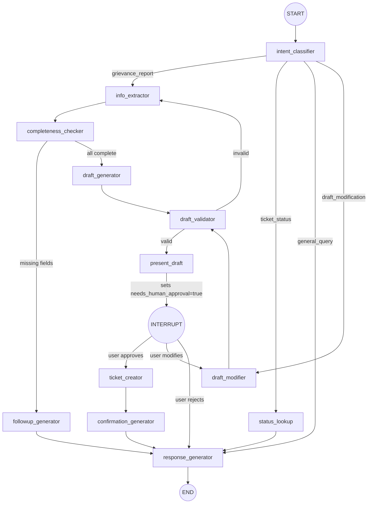

### Agent Tools (Controlled Access)

| Tool | Access | Description |
|------|--------|-------------|
| `get_categories()` | Read-only | Fetch valid ticket categories |
| `get_subcategories(category_id)` | Read-only | Fetch subcategories for a category |
| `search_user_tickets(query)` | Read-only, user-scoped | Search current user's tickets only |
| `get_ticket_status(ticket_number)` | Read-only, user-scoped | Get status of user's ticket |
| `create_ticket(draft)` | User-confirmed | Creates ticket ONLY after explicit approval |

> [!IMPORTANT]
> The `create_ticket` tool is **never callable directly by the LLM**. It is invoked only by the `ticket_creator` node, which runs only after the graph resumes from the human approval interrupt. This ensures no ticket is ever created without user consent.

---

## 7. Ticket State Machine

### State Transition Diagram

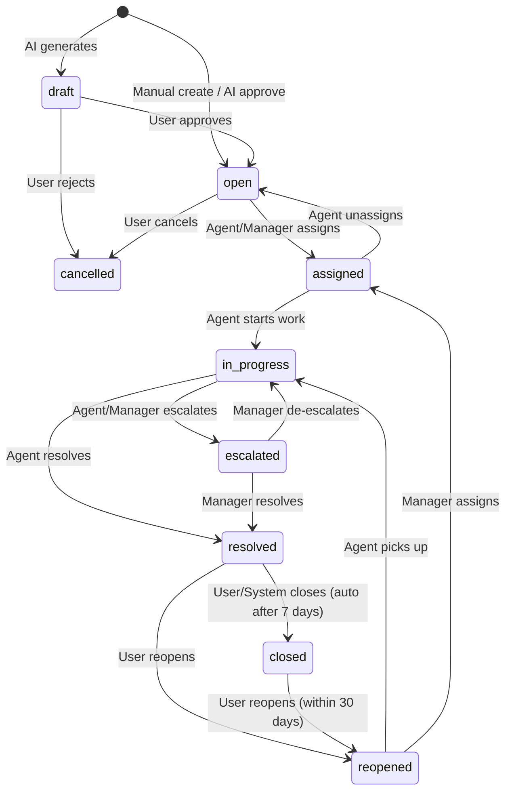

### Transition Permission Matrix

| From → To | User | Agent | Manager | Admin |
|-----------|------|-------|---------|-------|
| draft → open | ✅ | — | — | — |
| draft → cancelled | ✅ | — | — | ✅ |
| open → assigned | — | ✅ | ✅ | ✅ |
| open → cancelled | ✅ | — | ✅ | ✅ |
| assigned → in_progress | — | ✅ | ✅ | ✅ |
| assigned → open | — | ✅ | ✅ | ✅ |
| in_progress → resolved | — | ✅ | ✅ | ✅ |
| in_progress → escalated | — | ✅ | ✅ | ✅ |
| escalated → in_progress | — | — | ✅ | ✅ |
| escalated → resolved | — | — | ✅ | ✅ |
| resolved → closed | ✅ | ✅ | ✅ | ✅ |
| resolved → reopened | ✅ | — | ✅ | ✅ |
| closed → reopened | ✅ | — | ✅ | ✅ |

---

## 8. RBAC Model

### Role-Permission Hierarchy

```mermaid
graph TD
    subgraph Roles
        R1["user"]
        R2["agent"]
        R3["manager"]
        R4["admin"]
    end

    subgraph "Permissions"
        P1["ticket:create"]
        P2["ticket:read_own"]
        P3["ticket:read_assigned"]
        P4["ticket:read_team"]
        P5["ticket:read_all"]
        P6["ticket:update_own"]
        P7["ticket:update_assigned"]
        P8["ticket:update_all"]
        P9["ticket:assign"]
        P10["ticket:escalate"]
        P11["ticket:close_own"]
        P12["ticket:reopen"]
        P13["chat:create"]
        P14["chat:read_own"]
        P15["user:manage"]
        P16["category:manage"]
        P17["audit:read"]
        P18["dashboard:analytics"]
    end

    R1 --> P1 & P2 & P6 & P11 & P12 & P13 & P14
    R2 --> P1 & P2 & P3 & P7 & P9 & P10 & P13 & P14
    R3 --> P1 & P2 & P3 & P4 & P7 & P8 & P9 & P10 & P12 & P18
    R4 --> P1 & P2 & P3 & P4 & P5 & P6 & P7 & P8 & P9 & P10 & P11 & P12 & P13 & P14 & P15 & P16 & P17 & P18
```

### Seed Data

The system ships with 4 predefined roles and their permission mappings. Initial users are seeded via a migration script or a `seed_data.py` CLI command:

| User | Email | Role | Purpose |
|------|-------|------|---------|
| John Doe | john@company.com | user | End user creating tickets |
| Jane Smith | jane@company.com | user | End user creating tickets |
| Agent Bob | bob@company.com | agent | Support agent |
| Manager Alice | alice@company.com | manager | Team manager |
| Admin Root | admin@company.com | admin | System administrator |

---

## 9. Implementation Roadmap

### Overview

```mermaid
gantt
    title Implementation Milestones
    dateFormat  X
    axisFormat %s

    section Foundation
    M1 - Project Setup & DB Schema   :m1, 0, 2
    M2 - Auth & RBAC                 :m2, after m1, 2

    section Core
    M3 - Ticket CRUD & Lifecycle     :m3, after m2, 3
    M4 - Angular Shell & Dashboard   :m4, after m2, 3

    section AI
    M5 - Chat Infrastructure         :m5, after m3, 2
    M6 - LangGraph Agent             :m6, after m5, 3
    M7 - Human-in-the-Loop & Drafts  :m7, after m6, 2

    section Polish
    M8 - Real-time & Notifications   :m8, after m7, 1
    M9 - Testing & Security          :m9, after m8, 2
    M10 - Docker & Deployment        :m10, after m9, 1
```

---

### Milestone 1 — Project Setup, Docker, Database Schema

**Objective**: Scaffold the full project structure, stand up PostgreSQL, and run the initial migration.

**Deliverables**:
- `docker-compose.yml` with PostgreSQL, FastAPI backend, Angular frontend
- SQLAlchemy models for ALL tables (users, roles, permissions, tickets, categories, chat, audit)
- Alembic initial migration `001_initial_schema.py`
- Seed data script (roles, permissions, categories, test users)
- `app/config/settings.py` with Pydantic BaseSettings
- `app/db/session.py` with async SQLAlchemy engine
- Backend `Dockerfile`, Frontend `Dockerfile`
- Health check endpoint: `GET /health`

**Definition of Done**: `docker compose up` starts all services; `alembic upgrade head` creates all tables; seed data populates roles/users/categories.

---

### Milestone 2 — Authentication & RBAC

**Objective**: JWT-based auth with role-based access control enforced server-side.

**Deliverables**:
- `app/auth/jwt_handler.py` — token create/decode/refresh
- `app/auth/password.py` — bcrypt hash/verify
- `app/auth/rbac.py` — permission checking against user roles
- `app/api/dependencies/auth.py` — `get_current_user`, `require_role()`, `require_permission()`
- API routes: `POST /auth/login`, `POST /auth/refresh`, `POST /auth/logout`, `GET /auth/me`
- Angular: `login.component.ts`, `auth.service.ts`, `auth.interceptor.ts`, `auth.guard.ts`
- Middleware: request ID injection, structured logging

**Definition of Done**: Users can log in, receive JWT, access protected routes based on role. Unauthorized access returns 403.

---

### Milestone 3 — Ticket CRUD & Lifecycle

**Objective**: Full ticket management with state machine validation.

**Deliverables**:
- `app/core/ticket_state_machine.py` — transition validation with role guards
- `app/services/ticket_service.py` — create, read, update, list, state transitions
- `app/repositories/ticket_repo.py` — DB queries with pagination, filtering
- `app/services/file_service.py` — attachment upload/download
- API routes: `POST /tickets`, `GET /tickets`, `GET /tickets/{id}`, `PATCH /tickets/{id}`, `POST /tickets/{id}/comments`, `GET /tickets/{id}/history`
- Ticket number generation: `TKT-YYMMDD-XXXX`
- Idempotency key support on creation
- Optimistic locking via `version` column
- Ticket history recording on every state change

**Definition of Done**: Tickets can be created, listed, filtered, updated. State transitions are validated. History is recorded. Duplicate creation is prevented.

---

### Milestone 4 — Angular Dashboard & Ticket UI

**Objective**: Full frontend for dashboard, ticket list, ticket detail, and manual ticket creation.

**Deliverables**:
- `layout.component.ts` — sidebar + header shell
- `dashboard.component.ts` — stats cards + recent tickets table
- `ticket-list.component.ts` — filterable, sortable, paginated table
- `ticket-detail.component.ts` — full detail view with comments, attachments, timeline
- `ticket-create.component.ts` — reactive form with category/subcategory dropdowns
- Shared components: `status-badge`, `priority-badge`, `ticket-timeline`
- `role.guard.ts` — role-based route protection
- API services: `dashboard.service.ts`, `ticket.service.ts`

**Definition of Done**: User logs in → sees dashboard → can create ticket via form → sees it in list → can view details with timeline.

---

### Milestone 5 — Chat Infrastructure

**Objective**: Backend chat session management + Angular chat UI shell.

**Deliverables**:
- `app/models/chat.py` — ChatSession, ChatMessage, AITicketDraft models
- `app/services/chat_service.py` — session create, message persistence
- `app/repositories/chat_repo.py` — chat queries
- API routes: `POST /chat/sessions`, `GET /chat/sessions`, `POST /chat/sessions/{id}/messages`
- SSE streaming endpoint for AI responses
- Angular: `chat.component.ts`, `message-bubble`, `chat-input`, `typing-indicator`
- `chat.service.ts` — SSE subscription, message send

**Definition of Done**: User can open chat, send messages, see them persisted. SSE stream delivers responses (initially echo/mock).

---

### Milestone 6 — LangGraph Agent

**Objective**: Full AI agent with intent classification, information extraction, and draft generation.

**Deliverables**:
- `app/agents/state.py` — AgentState TypedDict
- `app/agents/graph.py` — compiled LangGraph with all nodes
- `app/agents/nodes/intent_classifier.py` — classify intent
- `app/agents/nodes/info_extractor.py` — extract ticket fields
- `app/agents/nodes/completeness_checker.py` — check missing fields
- `app/agents/nodes/draft_generator.py` — produce structured TicketDraft
- `app/agents/nodes/draft_validator.py` — validate against categories + schema
- `app/agents/nodes/response_generator.py` — generate conversational replies
- `app/agents/tools/` — category_tools, ticket_tools, user_tools
- `app/agents/prompts/` — system prompts, prompt templates
- Integration with `chat_service.py` — agent invocation on each message

**Definition of Done**: User describes grievance in chat → agent asks follow-ups → generates structured ticket draft → draft appears in chat as card.

---

### Milestone 7 — Human-in-the-Loop & Draft Approval

**Objective**: Pause agent for user approval, handle draft edits, create ticket on approval.

**Deliverables**:
- LangGraph interrupt/checkpoint at `present_draft` node
- `app/agents/nodes/ticket_creator.py` — create ticket via TicketService
- API routes: `POST /chat/sessions/{id}/drafts/{draft_id}/approve`, `PATCH /chat/sessions/{id}/drafts/{draft_id}`, `POST /chat/sessions/{id}/drafts/{draft_id}/reject`
- Angular: `ticket-draft-card` component with Edit/Approve/Reject buttons
- Draft revision tracking
- Resumption of agent graph after approval
- Ticket creation within DB transaction

**Definition of Done**: AI draft appears → user can edit fields → approve → ticket created in DB → confirmation in chat → ticket visible on dashboard.

---

### Milestone 8 — Real-time Dashboard Updates & Notifications

**Objective**: Dashboard auto-updates when tickets change.

**Deliverables**:
- `app/services/notification_service.py` — SSE event broadcaster
- `app/api/routes/events.py` — `GET /events/stream` SSE endpoint
- Events: `ticket_created`, `ticket_updated`, `ticket_assigned`
- Angular `sse.service.ts` — subscribe to event stream
- Dashboard auto-refresh on ticket events
- Notification badge in header

**Definition of Done**: Create ticket via chat → dashboard updates without page refresh.

---

### Milestone 9 — Testing & Security Hardening

**Objective**: Comprehensive test suite and security audit.

**Deliverables**:
- Backend: pytest suite (auth, RBAC, ticket CRUD, state machine, chat, agent)
- Agent tests: mock LLM, test all conversation paths
- Frontend: Jasmine/Karma component tests
- Rate limiting middleware
- Input sanitization
- File upload validation (type, size)
- CORS configuration
- Audit logging for all sensitive operations
- PII redaction in logs

**Definition of Done**: >80% backend test coverage. All security checklist items addressed.

---

### Milestone 10 — Production Docker & Deployment

**Objective**: Production-ready containerized deployment.

**Deliverables**:
- Multi-stage Dockerfiles (backend, frontend)
- `docker-compose.yml` with all services
- `docker-compose.prod.yml` overlay
- Nginx reverse proxy configuration
- Environment variable management
- PostgreSQL backup script
- Health check endpoints
- Structured logging with JSON output
- `README.md` with full setup instructions

**Definition of Done**: `docker compose -f docker-compose.yml -f docker-compose.prod.yml up` starts the entire system. All services healthy.

---

## Open Questions

> [!IMPORTANT]
> The following decisions should be confirmed before starting implementation:

1. **LLM Provider**: Should the system use local Ollama (current setup) or also support cloud providers (OpenAI, Anthropic) via configuration? The architecture is designed to be provider-agnostic.

2. **File Storage**: Local filesystem for development is planned. Should we also set up MinIO (S3-compatible) in Docker Compose for a more production-like experience?

3. **Email Notifications**: Should the system send email notifications on ticket status changes, or are in-app notifications sufficient for the initial release?

4. **Multi-tenancy**: Are all users within a single organization, or should the system support multiple tenants/organizations?

5. **SLA Tracking**: The plan mentions SLA monitoring for managers. Should we implement SLA rules (e.g., high priority must be resolved within 4 hours) with automated escalation?
